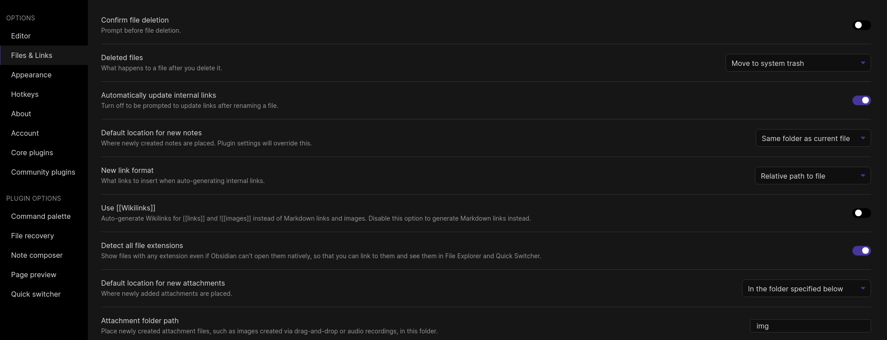
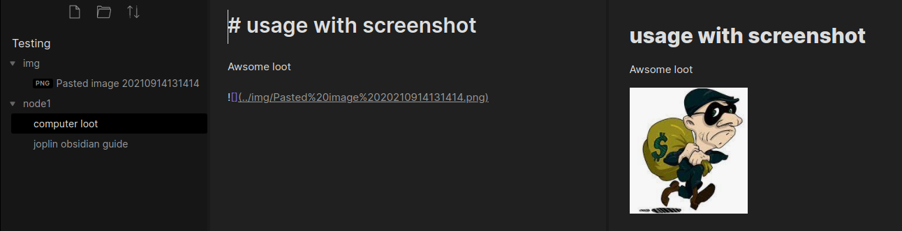
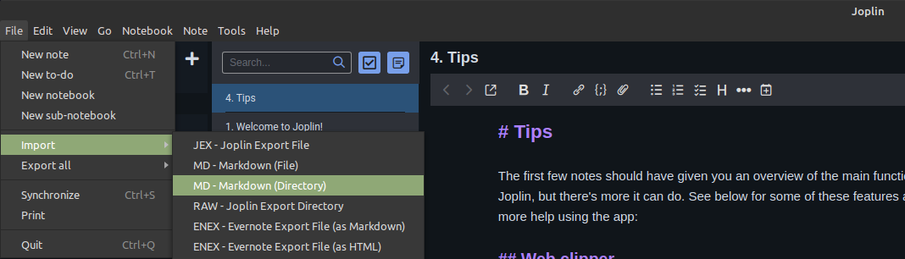
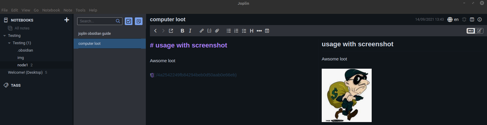

# Joplin Obsidian Guide

## Obsidian
### Settings

While using obsidian if the following settings are used then if you need to import into joplin there will be no breakage I have found.

The important settings to note are:

1. Automatically update link   
	- This will keep any pasted images correctly named on markdown
	- pasted images have to be renamed to get imported to joplin
2. New link format
	-  This set to Relative is the only way I found that joplin will import images correcly
	-  This also works with github
3. Use `[[Wikilinks]]`
	- This was not tested but Wikilinks doesn't work with github.
4. Default location for new attachments and Attachment folder path
	- This is not required but as shown in image below it helps keep folders organized.

## Joplin
Using the below import method you can import your whole vault

The import process for joplin will rename everything.

